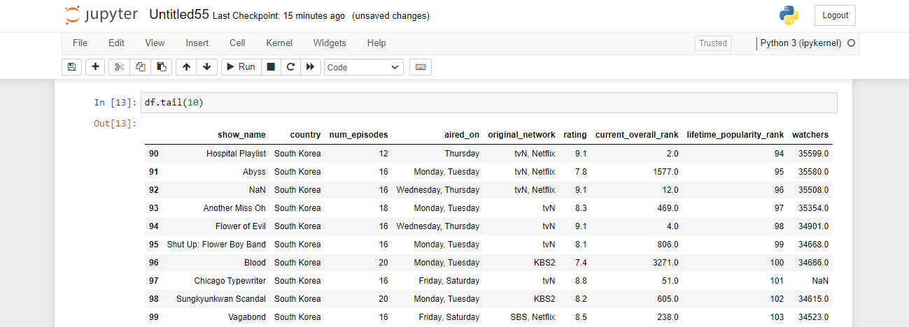
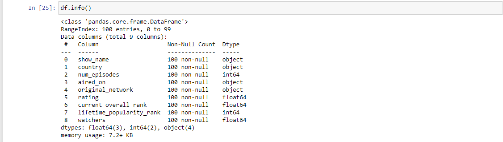
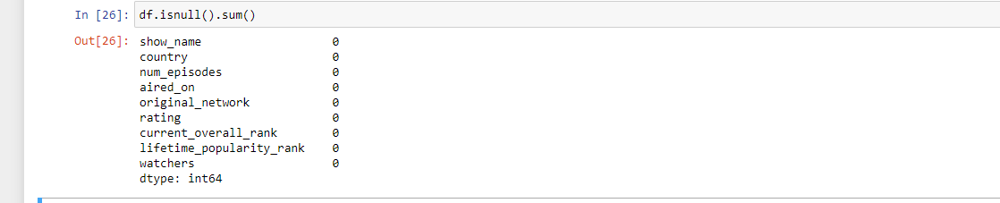

# Exno:1
Data Cleaning Process

# AIM
To read the given data and perform data cleaning and save the cleaned data to a file.

# Explanation
Data cleaning is the process of preparing data for analysis by removing or modifying data that is incorrect ,incompleted , irrelevant , duplicated or improperly formatted. Data cleaning is not simply about erasing data ,but rather finding a way to maximize datasets accuracy without necessarily deleting the information.

# Algorithm
STEP 1: Read the given Data

STEP 2: Get the information about the data

STEP 3: Remove the null values from the data

STEP 4: Save the Clean data to the file

STEP 5: Remove outliers using IQR

STEP 6: Use zscore of to remove outliers


# Coding
```
import pandas as pd
df=pd.read_csv("Data_set.csv")
print(df)
df.hesd(10)
df.tail(10)
df.info()
df.isnull().sum()
df['show_name']=df['show_name'].fillna(df['aired_on'].mode()[0])
df['aired_on']=df['aired_on'].fillna(df['aired_on'].mode()[0])
df['original_network']=df['original_network'].fillna(df['aired_on'].mode()[0])
df.head()
df['rating']=df['rating'].fillna(df['rating'].mean())
df['current_overall_rank']=df['current_overall_rank'].fillna(df['current_overall_rank'].mean())
df.head()
df['watchers']=df['watchers'].fillna(df['watchers'].median())
df.head()
df.info()
df.isnull().sum()

```
# OUTPUT
### READ_CSV

### HEAD

### TAIL

### INFO

### ISNULL

### ISNULL.SUM

# MODE

# MEAN

# MEDIAN

# AFTER CLEANING



# Result
         
Hence the given data is read and perform data cleaning and saved the cleaned data to a file.
