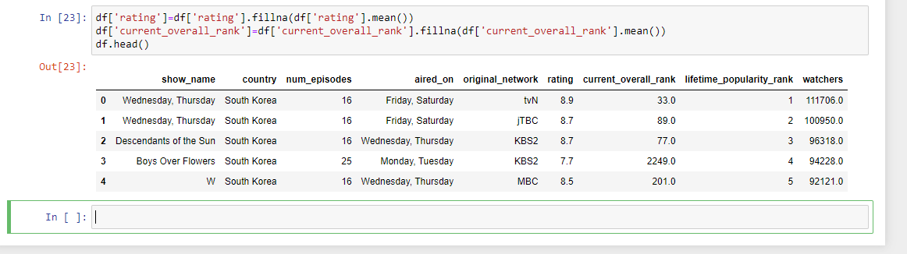
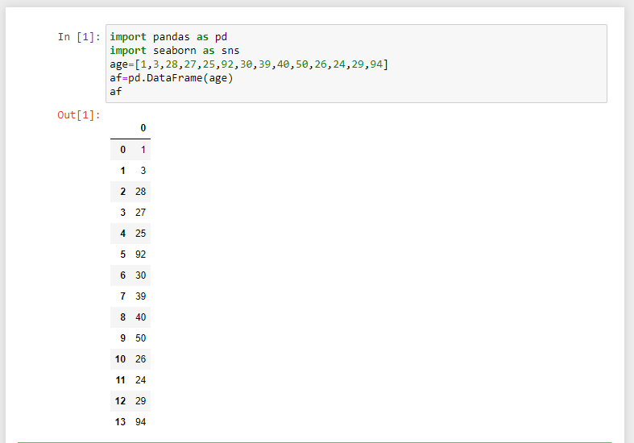

# Exno:1
Data Cleaning Process

# AIM
To read the given data and perform data cleaning and save the cleaned data to a file.

# Explanation
Data cleaning is the process of preparing data for analysis by removing or modifying data that is incorrect ,incompleted , irrelevant , duplicated or improperly formatted. Data cleaning is not simply about erasing data ,but rather finding a way to maximize datasets accuracy without necessarily deleting the information.

# Algorithm
STEP 1: Read the given Data

STEP 2: Get the information about the data

STEP 3: Remove the null values from the data

STEP 4: Save the Clean data to the file

STEP 5: Remove outliers using IQR

STEP 6: Use zscore of to remove outliers


# Coding
### Data Cleaning Process
```
import pandas as pd

# Read CSV file
df = pd.read_csv('Data_set.csv')

# Display information about the CSV
print(df.info())
print(df.describe())

# Check for null values in the dataset
null_values = df.isnull().sum()
print(null_values)

# Display the sum of null values in each row
print(df.isnull().sum(axis=1))

# Drop null values
df_dropped = df.dropna()

# Fill null values with a constant value "O"
df_filled_const = df.fillna("O")

# Fill null values with ffill or bfill method
df_filled_ffill = df.fillna(method='ffill')
df_filled_bfill = df.fillna(method='bfill')

# Calculate mean value of a column and fill it with null values
mean_age = df['age'].mean()
df_filled_mean = df.fillna({'age': mean_age})

# Display the final dataframes
print(df_dropped)
print(df_filled_const)
print(df_filled_ffill)
print(df_filled_bfill)
print(df_filled_mean)

```
### Outlier Detection and Removal
```
import pandas as pd
import seaborn as sns
from scipy import stats

# Data
age = [1, 3, 28, 27, 25, 92, 30, 39, 40, 50, 26, 24, 29, 94]
data = [1, 12, 15, 18, 21, 24, 27, 30, 33, 36, 39, 42, 45, 48, 51, 54, 57, 60, 63, 66, 69, 72, 75, 78, 81, 84, 87, 90, 93, 96, 99, 158]

# Creating DataFrames
af = pd.DataFrame(age, columns=['Age'])
df = pd.DataFrame(data, columns=['Value'])

# Boxplot to detect outliers
sns.boxplot(x=af['Age'])
# plt.show()  # Use this if not using Jupyter Notebook or any other environment that displays plots automatically

# IQR Method
Q1 = af['Age'].quantile(0.25)
Q3 = af['Age'].quantile(0.75)
IQR = Q3 - Q1
lower_bound = Q1 - 1.5 * IQR
upper_bound = Q3 + 1.5 * IQR
outliers_af = af[(af['Age'] < lower_bound) | (af['Age'] > upper_bound)]
print("Outliers detected using IQR method:")
print(outliers_af)

# Remove outliers
af_no_outliers = af[(af['Age'] >= lower_bound) & (af['Age'] <= upper_bound)]

# Boxplot to check if outliers are removed
sns.boxplot(x=af_no_outliers['Age'])
# plt.show()

# Boxplot to detect outliers
sns.boxplot(x=df['Value'])
# plt.show()

# Z Score Method
z_scores = stats.zscore(df['Value'])
threshold = 3
outliers_df = df[(z_scores < -threshold) | (z_scores > threshold)]
print("\nOutliers detected using Z-score method:")
print(outliers_df)

# Remove outliers
df_no_outliers = df[(z_scores > -threshold) & (z_scores < threshold)]

# Boxplot to check if outliers are removed
sns.boxplot(x=df_no_outliers['Value'])
# plt.show()
```

# OUTPUT
# Data Cleaning Process
## READ_CSV

## HEAD

## INFO

## DESCRIBE

## ISNULL

## ISNULL.SUM

## Fill null values with a constant value "O"

## FILL NULL VALUES WITH ffill or bfill METHOD

## MODE

## MEAN

## MEDIAN

## AFTER CLEANING


# Outlier Detection and Removal
# using IQR Methed
##  Data

##  Boxplot to detect outliers

## IQR Method

##  Remove outliers

## Boxplot to check if outliers are removed

# using Z-Score Method
## Data

## Boxplot to detect outliers

## Z Score Method

## Remove outliers

## Boxplot to check if outliers are removed


# Result
         
Hence the given data is read and perform data cleaning and saved the cleaned data to a file.
